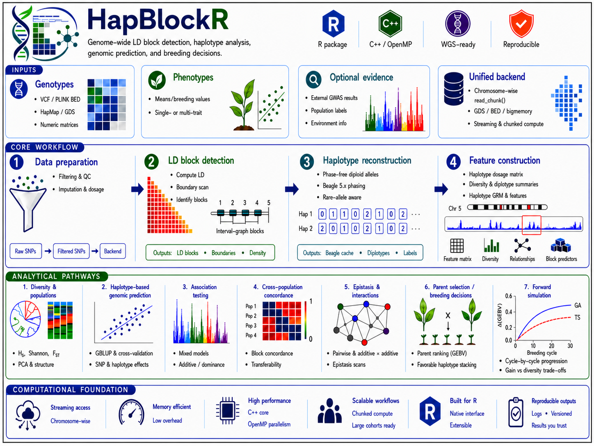

# HapBlockR

[](https://github.com/FAkohoue/HapBlockR/actions/workflows/R-CMD-check.yaml)
[](https://lifecycle.r-lib.org/articles/stages.html#experimental)

HapBlockR detects linkage-disequilibrium blocks and supports haplotype
analysis, genomic prediction, parent selection, optimum-contribution
selection, genomic mating, and core-collection design, as shown below:

<p align="center">
  
</p>

The package is under active development. HapBlockR converts the data,
breeding objectives and constraints supplied by the user into reproducible
parent, cross and mating recommendations. Every decision-critical result
carries quality-control, provenance, validation and uncertainty information,
so recommendation relevance is driven principally by the quality of the
input data and how accurately the parameters express the programme's
objectives — not by the package treating any output as ground truth.

## Installation

```r
install.packages("remotes")
remotes::install_github("FAkohoue/HapBlockR", build_vignettes = TRUE,
  dependencies = TRUE
)
```

Set `build_vignettes = FALSE` to skip building the vignettes locally (they
remain available on the package website). Required dependencies install
automatically; some methods use optional packages or external tools and fail
explicitly when the requested engine is unavailable.

## Quick example

```r
library(HapBlockR)

data(ldx_geno)
data(ldx_snp_info)
data(ldx_blocks)
data(ldx_blues)

targets <- prepare_breeding_targets(
  data.frame(
    id = ldx_blues$id,
    trait = "YLD",
    value = ldx_blues$YLD,
    precision = 1
  ),
  input_type = "adjusted_mean",
  precision_col = "precision"
)

prediction <- run_haplotype_prediction(
  geno_matrix = ldx_geno,
  snp_info = ldx_snp_info,
  blocks = ldx_blocks,
  blues = targets,
  seed = 42,
  min_reliability = 0.30,
  verbose = FALSE
)

top_blocks <- select_top_blocks(
  prediction$block_importance,
  n = min(10L, nrow(prediction$block_importance))
)

parents <- select_parents_ga(
  value_matrix = prediction$local_gebv[, top_blocks$block_id, drop = FALSE],
  n_founders = 8,
  seed = 42,
  n_reps = 5,
  verbose = FALSE
)

parents$selected
validate(parents)
summary(parents)
```

Decision-critical objects like `parents` inherit from `hapblockr_result`: a
versioned contract recording method, call, parameters, seed, sample/variant
identifiers, input hashes, quality gates, warnings, exclusions, and
decision/uncertainty tables. `validate()`, `summary()`, `as.data.frame()` and
`plot()` all work on it. A failed validation gate must be resolved before a
result is promoted to a breeding recommendation.

For the full walkthrough — target preparation, cross-validated prediction,
GA and GA+TS parent selection, family quotas, optimum-contribution
selection, core-collection design, feasibility screening, and export to a
certified mating plan — see `vignette("HapBlockR-full-pipeline")`.

## Capability map

| Task | Main functions |
| --- | --- |
| Import and identity-safe caching | `read_geno()`, `read_geno_bigmemory()` |
| LD and block detection | `compute_r2()`, `compute_rV2()`, `Big_LD()`, `run_Big_LD_all_chr()` |
| Statistical phasing | `phase_with_beagle()`, `read_phased_vcf()` |
| Haplotype extraction and diversity | `infer_block_haplotypes()`, `extract_haplotypes()`, `compute_haplotype_diversity()` |
| Association and epistasis | `test_block_haplotypes()`, `estimate_diplotype_effects()`, `scan_block_epistasis()` |
| Genomic prediction | `run_haplotype_prediction()`, `cv_haplotype_prediction()` |
| Multi-trait and G×E models | `fit_multitrait_gblup()`, `build_selection_index()`, `fit_gxe_gblup()` |
| Externally analysed breeding targets | `breeding_target_types()`, `prepare_breeding_targets()` |
| Local breeding values | `estimate_marker_effects()`, `compute_local_gebv()` |
| Parent shortlisting | `truncation_selection()`, coverage-only `select_parents_ga()`, joint GA+TS `select_parents_ga_ts()`, and `select_parents_by_family()`; both GA tools support Optimal Haplotype Selection (OHS) and Optimal Population Value (OPV) strategies |
| Cross and contribution decisions | `usefulness_criterion()`, `select_parents_ocs()`, `select_parents_pareto()` |
| Plan validation and diversity | `validate_crosses_exact()`, `select_core_collection()` |
| Operational feasibility | `screen_candidate_crosses()`, `certify_mating_plan()` |
| Standards-oriented exchange | `validate_breeding_metadata()`, `build_breeding_exchange()` |
| End-to-end LD workflow | `run_ldx_pipeline()` |

## Documentation

The package website has the full function reference. Vignettes cover each
topic in depth:

| Vignette | Covers |
| --- | --- |
| `HapBlockR-intro` | First orientation to the package |
| `HapBlockR-workflow` | Genotypes through a validated breeding decision |
| `HapBlockR-full-pipeline` | End-to-end run: targets to a certified mating plan |
| `HapBlockR-breeding-decisions` | Local GEBV to a crossing decision |
| `HapBlockR-programme-operations` | Breeding-target input contract, multi-trait index methods, feasibility and data exchange |
| `HapBlockR-phasing` | Configuring and validating external Beagle 5.x phasing |
| `HapBlockR-ld-metrics` | Standard r² and kinship-adjusted rV² |
| `HapBlockR-large-scale` | GDS/BED/`bigmemory` backends, memory and performance evidence |

`open_breeder_guide()` opens the versioned, source-backed Breeder's Guide
(PDF or HTML), which covers all decision tools, a worked numerical example,
data-quality and feasibility checks, and interpretation guidance for
quality-control gates and uncertainty:

```r
open_breeder_guide(format = "pdf")
open_breeder_guide(format = "html")
```

Its editable source is `inst/guide/HapBlockR_Breeder_Guide.Rmd`, rendered to
the shipped PDF/HTML via `tools/build_breeder_guide_accessible.cjs`.

## Reproducibility

For an auditable analysis:

```r
set.seed(42)
packageVersion("HapBlockR")
sessionInfo()
```

Retain the result object, source data release, input hashes, external-tool
checksums, exclusions, warnings, validation output, and signed decision
record. Do not place confidential germplasm or phenotype records in public
issues or repositories.

## Citation

```r
citation("HapBlockR")
```

Machine-readable citation metadata are provided in `CITATION.cff`. A DOI has
not yet been assigned; do not cite an invented or provisional DOI.

## Contributing and support

Read [CONTRIBUTING.md](CONTRIBUTING.md), the
[code of conduct](CODE_OF_CONDUCT.md), [security policy](SECURITY.md), and
[support guidance](SUPPORT.md). Report reproducible bugs through the
[GitHub issue tracker](https://github.com/FAkohoue/HapBlockR/issues).

## Licence

HapBlockR is distributed under the MIT licence. External tools and optional
dependencies retain their own licences.
